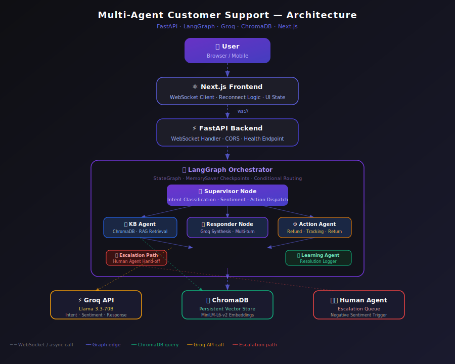

# ⚡ Support AI — Multi-Agent Customer Support System

A production-grade, stateful AI customer support platform orchestrated by **LangGraph**, powered by **Groq/Llama 3.3-70B**, with **ChromaDB** RAG retrieval and a real-time **Next.js** chat interface.



---


## Chatbot demo


---

## Features

- **Real-time WebSocket chat** — persistent connections with automatic exponential-backoff reconnection
- **LangGraph stateful orchestration** — typed `SupportState`, conditional routing, `MemorySaver` checkpoints for per-session multi-turn memory
- **Intent classification** — Groq/Llama extracts intent (`refund`, `tracking`, `return`, `complaint`, `general`) and order IDs from natural language
- **Sentiment analysis** — Groq-based; triggers automatic human escalation for negative sentiment
- **RAG knowledge base** — ChromaDB vector search with `all-MiniLM-L6-v2` embeddings; answers grounded in real KB documents
- **Action tools** — modular refund processing and order tracking stubs ready to connect to real APIs
- **Human escalation** — automatic routing to human agents on negative sentiment or complaint with no KB match
- **Groq-synthesised responses** — every final reply is generated by Llama 3.3-70B using KB context and conversation history; no hardcoded strings
- **Resolution logging** — non-blocking async writes of resolved cases to `resolved_cases.json`
- **Modern dark UI** — Next.js 15 + Tailwind CSS, typing indicator, connection status badge, error frames

---

## Architecture

```
User Browser
     │  WebSocket (ws://)
     ▼
Next.js Frontend  ←── reconnect logic, JSON frame parsing, typing indicator
     │  ws://host:8000/ws/chat
     ▼
FastAPI Backend   ←── per-connection UUID thread_id, lifespan warmup
     │
     ▼
LangGraph StateGraph (MemorySaver checkpoints)
     │
     ├─ supervisor_node
     │     ├── analyze_user_intent()   → Groq JSON classification
     │     ├── analyze_sentiment()     → Groq binary sentiment
     │     └── handle_action()         → refund / tracking / return tools
     │
     ├─ knowledge_retriever node
     │     └── search_knowledge_base() → ChromaDB vector search
     │
     └─ responder node
           ├── should_escalate()       → conditional human hand-off
           └── _synthesise_response()  → Groq LLM final reply
                                           grounded in KB context

External services:
  Groq API       — Llama 3.3-70B (intent, sentiment, response synthesis)
  ChromaDB       — persistent local vector store
  Human Agent    — escalation queue (stub; integrate your ticketing system)
```

### Data flow per message

1. Frontend sends raw text over WebSocket.
2. `websocket_handler` restores `conversation_history` from the MemorySaver checkpoint for this session.
3. `supervisor_node` classifies intent and sentiment via Groq; if actionable (refund/tracking), executes the tool immediately.
4. Routing: if action was taken → `responder`; otherwise → `knowledge_retriever` → `responder`.
5. `responder_node` decides escalation, then calls Groq to synthesise a grounded reply.
6. Response is serialised as `{ type: "ai" | "error", text: "..." }` JSON and sent back over WebSocket.
7. `conversation_history` is updated in state and persisted by MemorySaver.

---

## Tech Stack

| Layer | Technology |
|---|---|
| Frontend | Next.js 15, React 19, Tailwind CSS 3 |
| Backend | FastAPI, Uvicorn (ASGI) |
| Orchestration | LangGraph 0.2+, LangChain 0.2+ |
| LLM Inference | Groq API — `llama-3.3-70b-versatile` |
| Vector DB | ChromaDB (persistent local) |
| Embeddings | `all-MiniLM-L6-v2` via sentence-transformers |
| Memory | LangGraph MemorySaver (in-process; swap for Redis for multi-instance) |
| Language | Python 3.11+, TypeScript 5 |

---

## Project Structure

```
support-ai/
├── backend/
│   ├── app/
│   │   ├── agents/
│   │   │   ├── conversation_manager.py  # Groq intent classification
│   │   │   ├── sentiment_agent.py       # Groq sentiment analysis
│   │   │   ├── kb_agent.py              # ChromaDB RAG retrieval
│   │   │   ├── action_agent.py          # Refund / tracking dispatch
│   │   │   ├── escalation_agent.py      # Escalation decision logic
│   │   │   └── learning_agent.py        # Async resolution logger
│   │   ├── graph/
│   │   │   └── workflow.py              # LangGraph StateGraph DAG
│   │   ├── models/
│   │   │   └── state.py                 # SupportState TypedDict
│   │   ├── rag/
│   │   │   ├── chroma_client.py         # Lazy ChromaDB singleton
│   │   │   ├── embeddings.py            # Lazy SentenceTransformer
│   │   │   └── ingest.py                # Idempotent KB seeding script
│   │   ├── tools/
│   │   │   ├── refund_tool.py
│   │   │   └── tracking_tool.py
│   │   ├── websocket/
│   │   │   └── chat_socket.py           # Per-session UUID, error frames
│   │   ├── config.py                    # Env validation
│   │   └── main.py                      # FastAPI app, lifespan warmup
│   ├── requirements.txt
│   └── .env.example
├── frontend/
│   ├── app/
│   │   ├── page.tsx                     # Chat UI with reconnect + typing indicator
│   │   ├── layout.tsx
│   │   └── globals.css
│   ├── next.config.js
│   └── package.json
├── architecture.svg
└── README.md
```

---

## Installation

### Prerequisites

- Python 3.11+
- Node.js 20+
- A free [Groq API key](https://console.groq.com)

### Backend

```bash
cd backend

# Create virtual environment
python -m venv venv
source venv/bin/activate        # Windows: venv\Scripts\activate

# Install dependencies
pip install -r requirements.txt

# Configure environment
cp .env.example .env
# Edit .env and set GROQ_API_KEY=your_key_here

# Seed the knowledge base (run once)
python -m app.rag.ingest

# Start the server
uvicorn app.main:app --reload --host 0.0.0.0 --port 8000
```

### Frontend

```bash
cd frontend
npm install
npm run dev
# Open http://localhost:3000
```

---

## Environment Variables

| Variable | Required | Description |
|---|---|---|
| `GROQ_API_KEY` | ✅ Yes | Your Groq API key from console.groq.com |

---

## WebSocket Protocol

The backend sends JSON frames, not raw strings:

```jsonc
// AI response
{ "type": "ai", "text": "Your refund for order #12345 has been initiated." }

// Error frame (Groq timeout, graph failure, etc.)
{ "type": "error", "text": "I'm experiencing a technical issue. Please try again." }
```

The frontend discriminates on `type` and renders error frames in red. This prevents the UI from silently swallowing backend failures.

---

## Agent Workflow

```
Message received
       │
       ▼
[supervisor_node]
  ├─ Groq → intent + order_id
  ├─ Groq → sentiment (positive / negative)
  └─ if intent ∈ {refund, tracking, return} AND order_id exists
       └─ execute action tool → action_result
       │
   [route_after_supervisor]
       ├─ action_result set?  →  [responder_node]
       └─ no action           →  [knowledge_retriever]
                                       │
                                 ChromaDB vector search
                                       │
                              [responder_node]
                                  ├─ should_escalate?
                                  │     ├─ YES → escalation message
                                  │     └─ NO  → Groq synthesises reply
                                  └─ update conversation_history → END
```

---

## RAG Pipeline

1. **Ingestion** (`app/rag/ingest.py`) — documents are embedded with `all-MiniLM-L6-v2` and stored in ChromaDB using `upsert` (idempotent).
2. **Retrieval** (`app/agents/kb_agent.py`) — user query is embedded and the top-3 cosine-nearest documents are retrieved.
3. **Grounding** (`app/graph/workflow.py`) — retrieved documents are injected into the Groq system prompt. The LLM is instructed to answer **only** from KB context and to admit when it doesn't know, preventing hallucination.

To add documents to the knowledge base, extend the `SAMPLE_DOCS` list in `ingest.py` and re-run it.

---

## Future Improvements

- **Streaming responses** — switch to `ainvoke` with `stream_events` and send chunks over WebSocket for real-time token streaming
- **Redis MemorySaver** — replace in-process MemorySaver with `langgraph-checkpoint-redis` for horizontal scaling
- **Authentication** — add JWT-based session tokens so each user has their own isolated conversation history
- **Admin dashboard** — real-time view of active sessions, escalation queue, resolved cases
- **Tool integrations** — connect refund/tracking tools to real Shopify / Stripe / DHL APIs
- **Evaluation pipeline** — automated test suite against a golden dataset of support queries
- **Observability** — integrate LangSmith or OpenTelemetry for graph-level tracing

---

## Production Deployment

```bash
# Backend — run behind gunicorn with multiple workers
pip install gunicorn
gunicorn app.main:app -w 4 -k uvicorn.workers.UvicornWorker --bind 0.0.0.0:8000

# Frontend — production build
npm run build && npm start

# Docker Compose (recommended)
# See docker-compose.yml (add to project)
```

Security checklist before going live:
- [ ] Replace `allow_origins=["*"]` with your frontend domain
- [ ] Add rate limiting (e.g. `slowapi`) to the WebSocket endpoint
- [ ] Store `GROQ_API_KEY` in a secrets manager (AWS Secrets Manager, Vault)
- [ ] Enable HTTPS / WSS via a reverse proxy (nginx, Caddy)
- [ ] Switch MemorySaver to Redis for multi-instance deployments

---

## License

MIT
